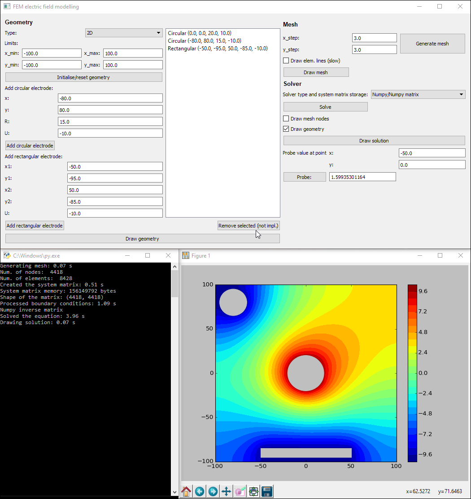

# py-simple-fem-elstatics
Simple Python electrostatics finite element method implementation with a GUI.

Dependencies:

* Standard python libraries: `numpy`, `matplotlib`
* `PySide` for the GUI

Comments in the code reference equations from the following book: Pei-bai Zhou "Numerical Analysis of Electromagnetic Fields" (1993)

Example usage and output is shown on the following image:

